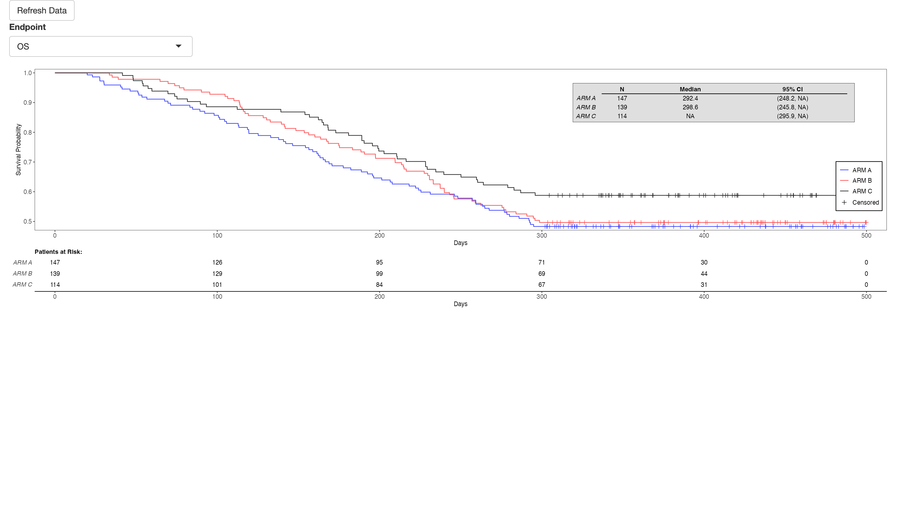
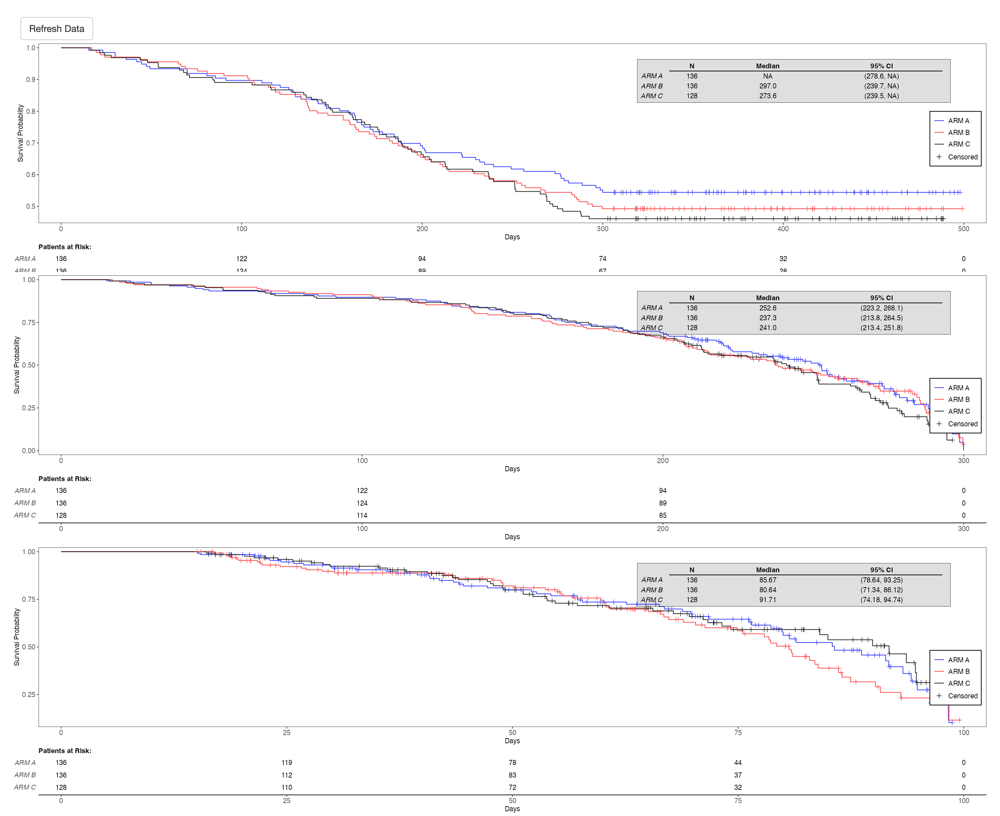
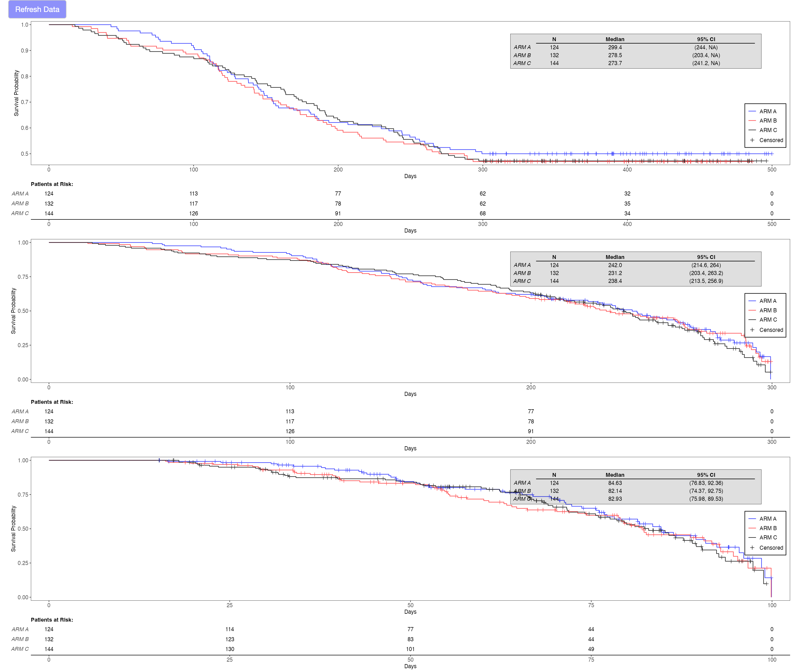
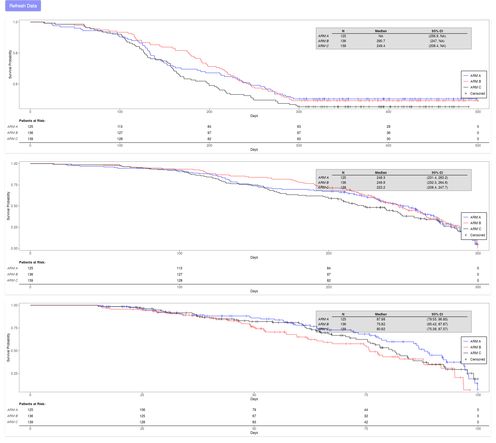
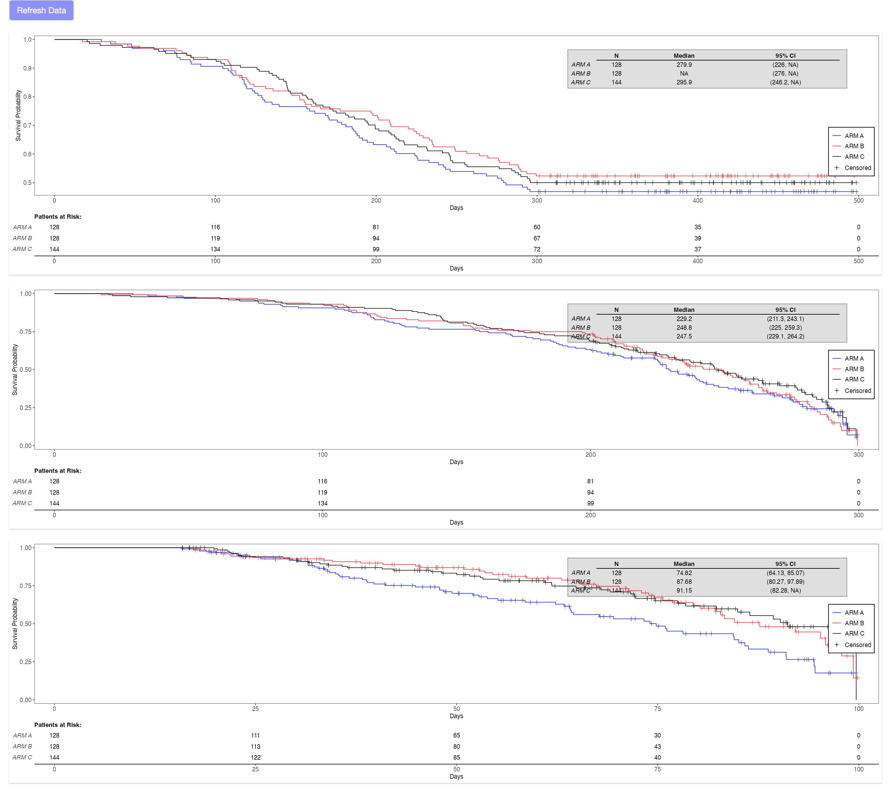
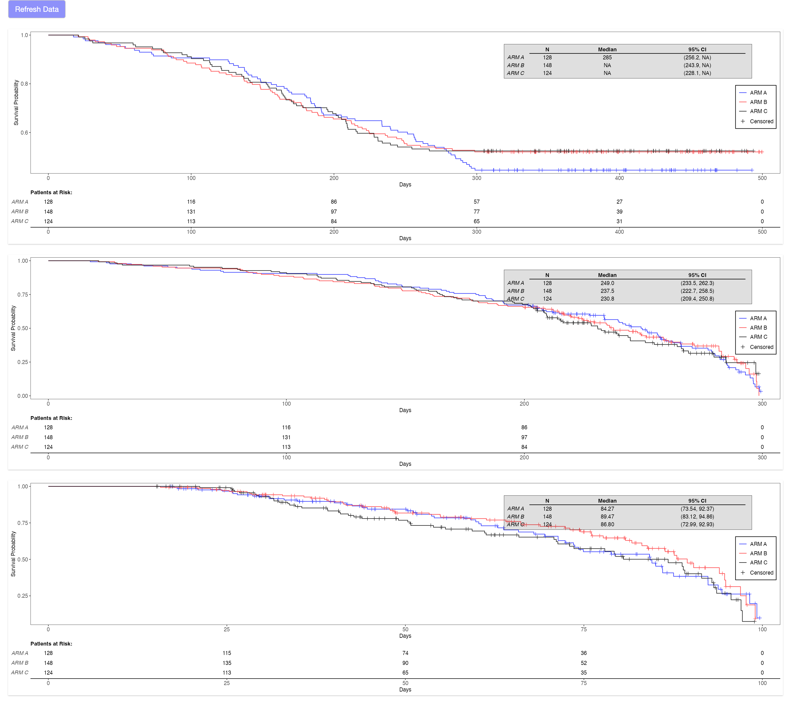
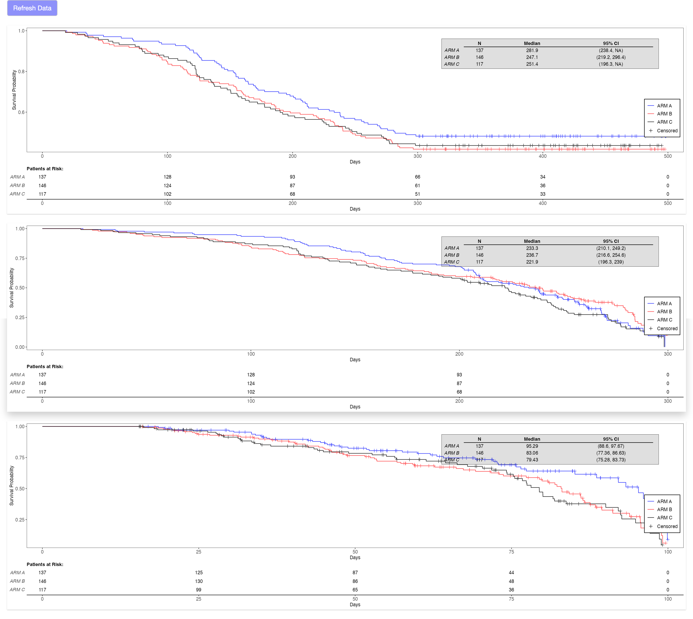
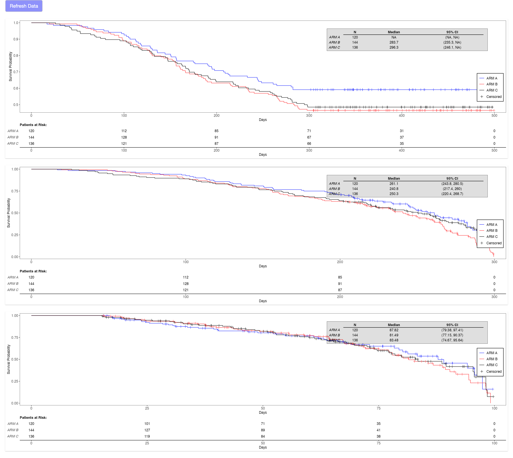
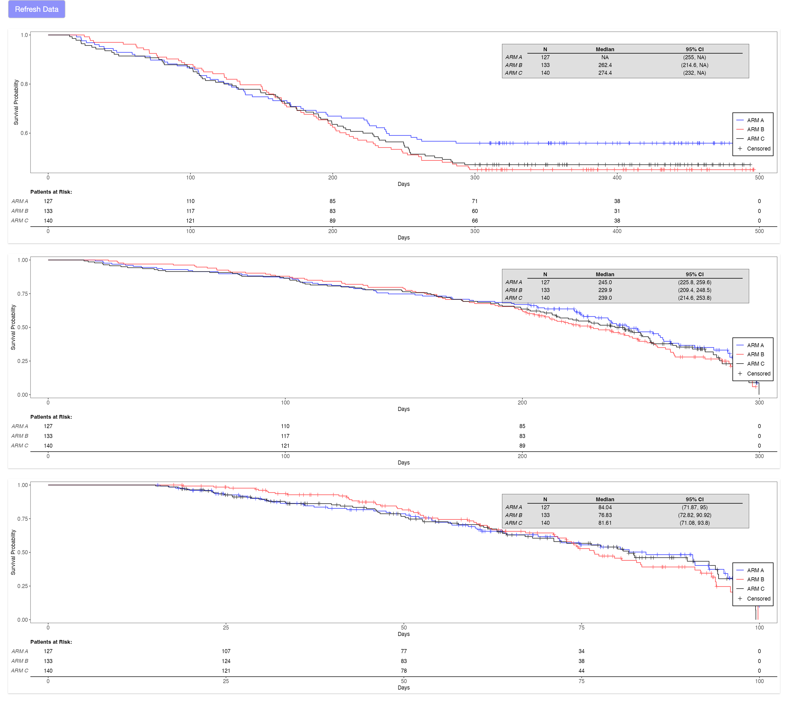

# Shiny apps with different structure

This repository contains different ways of structuring the same shiny app.

## Project Structure

The repository is organized into several directories, each demonstrating a different approach to structuring the same Shiny application:

1. **01_simple_app/**: A simple Shiny app to showcase all the key parts of the app.
2. **02_single_file/**: A shiny app with three KM plots which is created by just using a single `app.R` file.
3. **03_multiple_files/**: The same app is created by sourcing multiple R files.
4. **04_with_style/**: Extending the same app with some custom styles instead of inlines CSS.
5. **05_with_box/**: Replacing the `source` calls with the `box` imports.
6. **06_with_box_and_modules/**: Using shiny modules instead of having all the shiny logic in one place.
7. **07_with_tests/**: Adding some unit tests using the `testthat` package.
8. **08_golem/**: Implementation of the same app using the `golem` framework.
9. **09_rhino/**: Implementation of the same app using the `rhino` framework.

## Getting Started

### Package dependencies

Please install these packages to run these apps locally:

```r
install.packages(c("rhino", "golem", "tern", "nestcolor", "dplyr", "random.cdisc.data"), repos = "https://packagemanager.posit.co/cran/latest")
```

### Running the apps

After cloning the repository you can run these R commands to run the app contained in a particular directory:

```r
shiny::runApp("01_simple_app")
shiny::runApp("02_single_file")
shiny::runApp("03_multiple_files")
shiny::runApp("04_with_style")
shiny::runApp("05_with_box")
shiny::runApp("06_with_box_and_modules")
shiny::runApp("07_with_tests")
setwd("08_golem"); golem::run_den()
shiny::runApp("09_rhino")
```

### App screenshots

#### 01_simple_app

```md
01_simple_app
└── app.R
```



#### 02_single_file

```md
02_single_file
└── app.R
```



#### 03_multiple_files

```md
03_multiple_files
├── app.R
├── data.R
├── dependencies.R
└── plot.R
```



#### 04_with_style

```md
04_with_style
├── app.R
├── data.R
├── dependencies.R
├── plot.R
└── style.css
```



#### 05_with_box

```md
05_with_box
├── app.R
├── data.R
├── plot.R
└── style.css
```



#### 06_with_box_and_modules

```md
06_with_box_and_modules
├── app.R
├── modules
│   ├── data.R
│   └── plot.R
└── style.css
```



#### 07_with_tests

```md
07_with_tests
├── app.R
├── modules
│   ├── data.R
│   └── plot.R
├── style.css
└── testthat
    └── test-main.R
```



#### 08_golem

```md
08_golem
├── DESCRIPTION
├── NAMESPACE
├── R
│   ├── app_config.R
│   ├── app_server.R
│   ├── app_ui.R
│   ├── data.R
│   ├── plot.R
│   └── run_app.R
├── dev
│   ├── 01_start.R
│   ├── 02_dev.R
│   ├── 03_deploy.R
│   └── run_dev.R
├── golem.Rproj
├── inst
│   ├── app
│   │   └── www
│   │       ├── favicon.ico
│   │       └── style.css
│   └── golem-config.yml
├── man
│   └── run_app.Rd
└── tests
    ├── testthat
    │   └── test-main.R
    └── testthat.R
```



#### 09_rhino

```md
09_rhino
├── app
│   ├── js
│   │   └── index.js
│   ├── logic
│   │   ├── __init__.R
│   │   ├── data_utils.R
│   │   └── plot.R
│   ├── main.R
│   ├── static
│   │   ├── css
│   │   │   └── app.min.css
│   │   └── favicon.ico
│   ├── styles
│   │   └── main.scss
│   └── view
│       ├── __init__.R
│       ├── data_refresh.R
│       └── km_plot.R
├── app.R
├── config.yml
├── dependencies.R
├── renv
│   ├── activate.R
│   └── settings.json
├── renv.lock
├── rhino.Rproj
├── rhino.yml
└── tests
    ├── cypress
    │   └── e2e
    │       └── app.cy.js
    ├── cypress.config.js
    └── testthat
        └── test-main.R
```


